<!-- Generated by scripts/build_catalog.py; edit data/ and i18n/. -->
# 🏆 GitHub ସଫଳତା ସଂଗ୍ରହ

GitHub ର ସାର୍ବଜନୀନ, ଐତିହାସିକ, ପରୀକ୍ଷାମୂଳକ ଓ ଆଭ୍ୟନ୍ତରୀଣ ପ୍ରୋଫାଇଲ୍ ବ୍ୟାଜ୍‌ର ମାର୍ଗଦର୍ଶିକା।

**ଯାଞ୍ଚ ତାରିଖ: 2026-09-30** · 14 ସଫଳତା · 7 ପ୍ରୋଫାଇଲ୍ ଚିହ୍ନ

[English](english.md) · [Русский](russian.md) · [Українська](ukrainian.md) · [简体中文](chinese.md) · [正體中文](traditional-chinese.md) · [Nederlands](dutch.md) · [Français](french.md) · [Deutsch](german.md) · [Ελληνικά](greek.md) · [हिन्दी](hindi.md) · [Bahasa Indonesia](indonesian.md) · [Italiano](italian.md) · [ಕನ್ನಡ](kannada.md) · [한국어](korean.md) · [ଓଡ଼ିଆ](odia.md) · [Naijá](pidgin.md) · [Polski](polish.md) · [Português](portuguese.md) · [Español](spanish.md) · [Kiswahili](swahili.md) · [தமிழ்](tamil.md) · [తెలుగు](telugu.md) · [Türkçe](turkish.md) · [Tiếng Việt](vietnamese.md) · [isiZulu](zulu.md)

> କେବଳ ସାର୍ବଜନୀନ ଭାବେ ଲିପିବଦ୍ଧ ବ୍ୟାଜ୍ ଅନ୍ତର୍ଭୁକ୍ତ; ଅପ୍ରକାଶିତ ଆଭ୍ୟନ୍ତରୀଣ ପରୀକ୍ଷାର ପୂର୍ଣ୍ଣତା ଯାଞ୍ଚ କରିହେବ ନାହିଁ।

## 🧭 ନେଭିଗେସନ୍

[ପାଇପାରିବେ](#active) · [ଐତିହାସିକ](#retired) · [ପରୀକ୍ଷାମୂଳକ / ବନ୍ଦ](#experimental) · [GitHub ଆଭ୍ୟନ୍ତରୀଣ ପୁରସ୍କାର](#internal) · [ସ୍ତର](#tiers) · [ଦୃଶ୍ୟ ରୂପାନ୍ତର](#variants) · [ପ୍ରୋଫାଇଲ୍ ଚିହ୍ନ](#highlights) · [ଇତିହାସ ଏବଂ ପ୍ରମାଣ](#history) · [ଉତ୍ସ](#sources)

| ସ୍ଥିତି | # |
| --- | ---: |
| 🟢 [ପାଇପାରିବେ](#active) | 7 |
| 🕰️ [ଐତିହାସିକ](#retired) | 2 |
| 🧪 [ପରୀକ୍ଷାମୂଳକ / ବନ୍ଦ](#experimental) | 2 |
| 🔒 [GitHub ଆଭ୍ୟନ୍ତରୀଣ ପୁରସ୍କାର](#internal) | 3 |

> GitHub 2026-09-23 ରେ ପ୍ରଦାନ ଓ ପ୍ରଦର୍ଶନ ବିଳମ୍ବ ଜଣାଇଛି; ବ୍ୟାଜ୍ ନଥିବା ମାନେ ବନ୍ଦ ନୁହେଁ। [S08](https://github.com/orgs/community/discussions/203416)

## 🟢 ପାଇପାରିବେ

ସୀମାଗୁଡ଼ିକ ସମୁଦାୟର ନିରୀକ୍ଷଣରୁ ଆସିଛି। ସେଟିଂ ଚାଲୁ ଥିଲେ ବ୍ୟକ୍ତିଗତ ଯୋଗଦାନ ମଧ୍ୟ ଗଣାଯାଇପାରେ।

### Starstruck

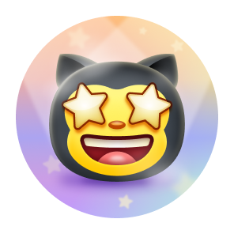

**16 ତାରକା** ପାଇଥିବା ରିପୋଜିଟୋରୀ ତିଆରି କରନ୍ତୁ; ଉଚ୍ଚ ସ୍ତର ଏହାର ତାରକା ସଂଖ୍ୟା ଉପରେ ନିର୍ଭର କରେ।

**ସ୍ତର:** 16 → 128 → 512 → 4096 (ରିପୋଜିଟୋରୀ ତାରକା).

[ପ୍ରକୃତ ଉଦାହରଣ](https://github.com/torvalds?achievement=starstruck&tab=achievements) · [S21](https://github.com/torvalds?achievement=starstruck&tab=achievements) · [S03](https://github.blog/news-insights/product-news/introducing-achievements-recognizing-the-many-stages-of-a-developers-coding-journey/) · [S15](https://github.com/Schweinepriester/github-profile-achievements)

### Pull Shark

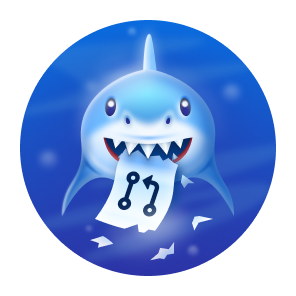

ମର୍ଜ ହୋଇଥିବା **2 pull request** ର ଲେଖକ ହୁଅନ୍ତୁ।

**ସ୍ତର:** 2 → 16 → 128 → 1024 (ଲେଖକଙ୍କ ମର୍ଜ PR).

[ପ୍ରକୃତ ଉଦାହରଣ](https://github.com/ljharb?achievement=pull-shark&tab=achievements) · [S22](https://github.com/ljharb?achievement=pull-shark&tab=achievements) · [S03](https://github.blog/news-insights/product-news/introducing-achievements-recognizing-the-many-stages-of-a-developers-coding-journey/) · [S15](https://github.com/Schweinepriester/github-profile-achievements)

### Pair Extraordinaire

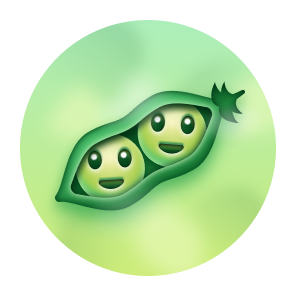

ମର୍ଜ ହୋଇଥିବା **1 PR** ର କମିଟ୍‌ରେ ସହଲେଖକ ହୁଅନ୍ତୁ; ଠିକ୍ `Co-authored-by` ବ୍ୟବହାର କରନ୍ତୁ।

**ସ୍ତର:** 1 → 10 → 24 → 48 (ସହଲେଖକଙ୍କ ମର୍ଜ PR).

[ପ୍ରକୃତ ଉଦାହରଣ](https://github.com/Rongronggg9?achievement=pair-extraordinaire&tab=achievements) · [S23](https://github.com/Rongronggg9?achievement=pair-extraordinaire&tab=achievements) · [S18](https://docs.github.com/en/pull-requests/committing-changes-to-your-project/creating-and-editing-commits/creating-a-commit-with-multiple-authors) · [S15](https://github.com/Schweinepriester/github-profile-achievements)

### Galaxy Brain

Discussions ରେ **2 ଗ୍ରହଣୀୟ ଉତ୍ତର** ପାଆନ୍ତୁ। `github.com/orgs/community` ରେ 2024-02-06 ରୁ ପ୍ରଦାନ ବନ୍ଦ।

**ସ୍ତର:** 2 → 8 → 16 → 32 (ଗ୍ରହଣୀୟ ଉତ୍ତର).

[ପ୍ରକୃତ ଉଦାହରଣ](https://github.com/ljharb?achievement=galaxy-brain&tab=achievements) · [S24](https://github.com/ljharb?achievement=galaxy-brain&tab=achievements) · [S06](https://github.com/orgs/community/discussions/106536) · [S03](https://github.blog/news-insights/product-news/introducing-achievements-recognizing-the-many-stages-of-a-developers-coding-journey/) · [S15](https://github.com/Schweinepriester/github-profile-achievements)

### Quickdraw

ଖୋଲିବା ପରେ **5 ମିନିଟ୍ ଭିତରେ** issue ବା PR ବନ୍ଦ କରନ୍ତୁ।

[ପ୍ରକୃତ ଉଦାହରଣ](https://github.com/Schweinepriester?achievement=quickdraw&tab=achievements) · [S25](https://github.com/Schweinepriester?achievement=quickdraw&tab=achievements) · [S03](https://github.blog/news-insights/product-news/introducing-achievements-recognizing-the-many-stages-of-a-developers-coding-journey/) · [S15](https://github.com/Schweinepriester/github-profile-achievements)

### YOLO

ନିଜ PR **କୋଡ୍ ସମୀକ୍ଷା ବିନା** ମର୍ଜ କରନ୍ତୁ; ବିସ୍ତୃତ ଅଧିକୃତ ନିୟମ ପ୍ରକାଶିତ ହୋଇନାହିଁ।

[ପ୍ରକୃତ ଉଦାହରଣ](https://github.com/Schweinepriester?achievement=yolo&tab=achievements) · [S26](https://github.com/Schweinepriester?achievement=yolo&tab=achievements) · [S03](https://github.blog/news-insights/product-news/introducing-achievements-recognizing-the-many-stages-of-a-developers-coding-journey/) · [S15](https://github.com/Schweinepriester/github-profile-achievements)

### Public Sponsor

**GitHub Sponsors** ମାଧ୍ୟମରେ ବିକାଶକ ବା ସଂଗଠନକୁ ସାର୍ବଜନୀନ ଭାବେ ପ୍ରାୟୋଜନ କରନ୍ତୁ।

[ପ୍ରକୃତ ଉଦାହରଣ](https://github.com/ljharb?achievement=public-sponsor&tab=achievements) · [S27](https://github.com/ljharb?achievement=public-sponsor&tab=achievements) · [S19](https://github.com/sponsors) · [S02](https://github.blog/news-insights/company-news/open-source-goes-to-mars/)

## 🕰️ ଐତିହାସିକ

ଏହି ଆୟୋଜନ ସମାପ୍ତ। ପୁରୁଣା ପୁରସ୍କାର ରହିପାରେ; ନୂଆ ଯୋଗଦାନ ଏଗୁଡ଼ିକୁ ଖୋଲେ ନାହିଁ।

### Arctic Code Vault Contributor

**2020-02-02 Arctic Code Vault ସ୍ନାପ୍‌ଶଟ୍** ର ଯୋଗ୍ୟ ରିପୋଜିଟୋରୀକୁ ଯୋଗଦାନ କରନ୍ତୁ। ଆୟୋଜନ ବନ୍ଦ।

[ପ୍ରକୃତ ଉଦାହରଣ](https://github.com/JakubOleksy?achievement=arctic-code-vault-contributor&tab=achievements) · [S04](https://github.blog/open-source/maintainers/the-arctic-code-vault-starts-production-and-your-open-source-projects-are-being-archived/) · [S05](https://archiveprogram.github.com/)

### Mars 2020 Contributor

**NASA/JPL Ingenuity** ବ୍ୟବହୃତ ନିର୍ଦ୍ଦିଷ୍ଟ ପ୍ରକଳ୍ପ ସଂସ୍କରଣରେ କମିଟ୍ ଲେଖନ୍ତୁ। ଆୟୋଜନ ସମାପ୍ତ।

[ପ୍ରକୃତ ଉଦାହରଣ](https://github.com/torvalds?achievement=mars-2020-contributor&tab=achievements) · [S01](https://docs.github.com/en/account-and-profile/reference/profile-reference) · [S02](https://github.blog/news-insights/company-news/open-source-goes-to-mars/)

## 🧪 ପରୀକ୍ଷାମୂଳକ / ବନ୍ଦ

ମାର୍ଚ୍ଚ 2026 ର ପୁନଃସକ୍ରିୟତା ଭୁଲ ଥିଲା ବୋଲି GitHub ନିଶ୍ଚିତ କରିଛି; ସାର୍ବଜନୀନ ମୁକ୍ତି ତାରିଖ ନାହିଁ।

### Heart On Your Sleeve

❤️ ପ୍ରତିକ୍ରିୟାର ପରୀକ୍ଷା; ମାର୍ଚ୍ଚ 2026 ର ଭୁଲ ସକ୍ରିୟତା ଫେରାଇ ନିଆଗଲା। ବର୍ତ୍ତମାନ ପ୍ରାପ୍ତି ପଦ୍ଧତି ନିଶ୍ଚିତ ନୁହେଁ।

[S07](https://github.com/orgs/community/discussions/190746) · [S15](https://github.com/Schweinepriester/github-profile-achievements)

### Open Sourcerer

ଅନେକ ସାର୍ବଜନୀନ ରିପୋଜିଟୋରୀର ମର୍ଜ PR ର ପରୀକ୍ଷା; ସଠିକ୍ ନିୟମ ପ୍ରକାଶିତ ହୋଇନାହିଁ।

[S07](https://github.com/orgs/community/discussions/190746) · [S15](https://github.com/Schweinepriester/github-profile-achievements)

## 🔒 GitHub ଆଭ୍ୟନ୍ତରୀଣ ପୁରସ୍କାର

Proxima ର ଆଭ୍ୟନ୍ତରୀଣ ପର୍ଯ୍ୟାୟ; ସାର୍ବଜନୀନ ପ୍ରାପ୍ତି ପଦ୍ଧତି ବା ନିଶ୍ଚିତ ଶେଷ ତାରିଖ ନାହିଁ।

### Proxima Pioneer

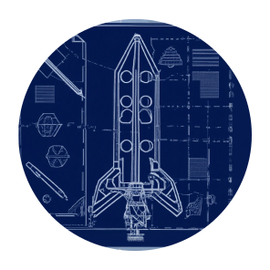

**M0 Participant** — **Proxima ପ୍ରମାଣ ନମୁନା (POC)** ରେ ଯୋଗଦାନ; @JakubOleksy ଠାରେ ଦେଖାଯାଇଛି।

[ପ୍ରକୃତ ଉଦାହରଣ](https://github.com/JakubOleksy?achievement=proxima-pioneer&tab=achievements) · [S10](https://github.com/JakubOleksy?achievement=proxima-pioneer&tab=achievements)

### Proxima Staffshipper

**M8 Participant** — **Proxima Staffship ଇନ୍‌ଷ୍ଟାନ୍ସ** ଆରମ୍ଭ; @JakubOleksy ଠାରେ ଦେଖାଯାଇଛି।

[ପ୍ରକୃତ ଉଦାହରଣ](https://github.com/JakubOleksy?achievement=proxima-staffshipper&tab=achievements) · [S11](https://github.com/JakubOleksy?achievement=proxima-staffshipper&tab=achievements)

### Proxima Staffuser

**ଦଳ Proxima ରେ ଯୋଗଦେଲା**, @timrogers ଠାରେ ଦେଖାଯାଇଛି। ତୃତୀୟ ଜଣାଶୁଣା Proxima ପୁରସ୍କାର।

[ପ୍ରକୃତ ଉଦାହରଣ](https://github.com/timrogers?achievement=proxima-staffuser&tab=achievements) · [S12](https://github.com/timrogers?achievement=proxima-staffuser&tab=achievements)

## 🥇 ସ୍ତର

ମୂଳ → କାଂସ୍ୟ → ରୌପ୍ୟ → ସ୍ୱର୍ଣ୍ଣ। x2/x3/x4 ସ୍ତର ଚିହ୍ନ। 2026-09-11 ରୁ ସର୍ବୋଚ୍ଚ ସ୍ତର ଦେଖାଯାଏ।

| ସଫଳତା | ଗଣାଯାଉଥିବା କାର୍ଯ୍ୟ | ମୂଳ | 🥉 x2 | 🥈 x3 | 🥇 x4 |
| --- | --- | ---: | ---: | ---: | ---: |
| [Starstruck](#starstruck) | ରିପୋଜିଟୋରୀ ତାରକା | 16 | 128 | 512 | 4096 |
| [Pull Shark](#pull-shark) | ଲେଖକଙ୍କ ମର୍ଜ PR | 2 | 16 | 128 | 1024 |
| [Pair Extraordinaire](#pair-extraordinaire) | ସହଲେଖକଙ୍କ ମର୍ଜ PR | 1 | 10 | 24 | 48 |
| [Galaxy Brain](#galaxy-brain) | ଗ୍ରହଣୀୟ ଉତ୍ତର | 2 | 8 | 16 | 32 |

ବ୍ୟାଜ୍ ଗ୍ୟାଲେରୀ

| ସଫଳତା | ମୂଳ | 🥉 x2 | 🥈 x3 | 🥇 x4 |
| --- | :---: | :---: | :---: | :---: |
| Starstruck |  | 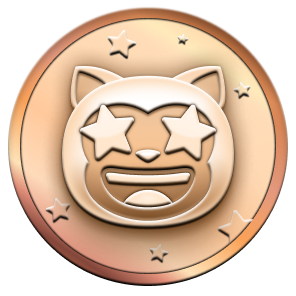 | 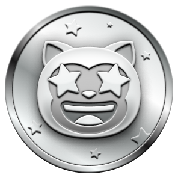 | 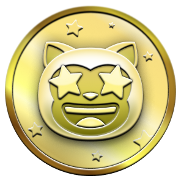 |
| Pull Shark |  |  |  |  |
| Pair Extraordinaire |  | 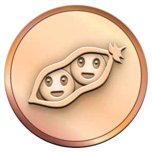 | 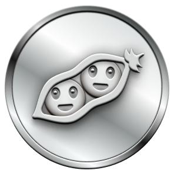 | 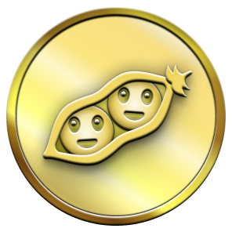 |
| Galaxy Brain |  | 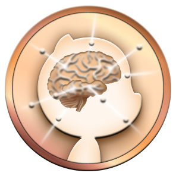 |  | 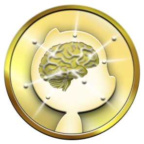 |
| Heart On Your Sleeve |  | 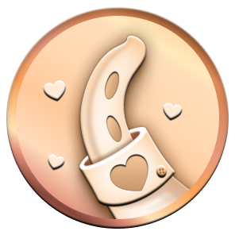 | 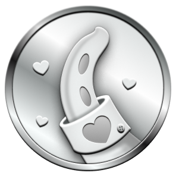 | 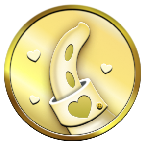 |
| Open Sourcerer |  | 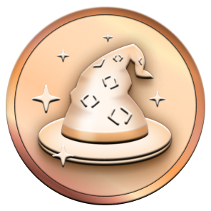 |  | 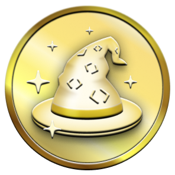 |

ପରୀକ୍ଷାମୂଳକ ଚିତ୍ର ଅଛି; ନିମ୍ନ ସୀମାଗୁଡ଼ିକ ଅସ୍ଥାୟୀ ସମୁଦାୟ ରିପୋର୍ଟ, ନିଶ୍ଚିତ ନିୟମ ନୁହେଁ।

| ସଫଳତା | ମୂଳ | 🥉 x2 | 🥈 x3 | 🥇 x4 |
| --- | ---: | ---: | ---: | ---: |
| Heart On Your Sleeve | ନିଶ୍ଚିତ ନୁହେଁ | 16 | 128 | ନିଶ୍ଚିତ ନୁହେଁ |
| Open Sourcerer | ନିଶ୍ଚିତ ନୁହେଁ | 8 | 16 | 64 |

[S15](https://github.com/Schweinepriester/github-profile-achievements)

## 🎨 ଦୃଶ୍ୟ ରୂପାନ୍ତର

Starstruck ଓ Quickdraw ର ଚର୍ମରଙ୍ଗ ରୂପାନ୍ତର କେବଳ ଦେଖାଣି ବଦଳାଏ।

[ଦେଖାଣି ସେଟିଂ](https://github.com/settings/appearance)

| ସଫଳତା | 👋 | 👋🏻 | 👋🏼 | 👋🏽 | 👋🏾 | 👋🏿 |
| --- | :---: | :---: | :---: | :---: | :---: | :---: |
| Starstruck |  |  |  |  |  |  |
| Quickdraw |  | 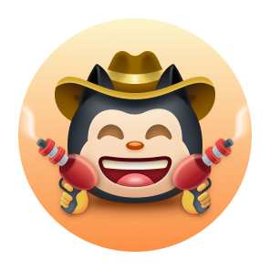 |  | 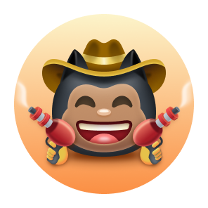 | 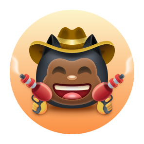 | 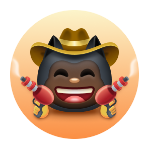 |

## ✨ ପ୍ରୋଫାଇଲ୍ ଚିହ୍ନ

Highlights ଅଲଗା କାର୍ଯ୍ୟକ୍ରମ ବା ଆକାଉଣ୍ଟ ଚିହ୍ନ; ଉପଲବ୍ଧତା କାର୍ଯ୍ୟକ୍ରମ ଉପରେ ନିର୍ଭର କରେ।

| ନାମ | ସ୍ଥିତି | ସର୍ତ୍ତ | ଉତ୍ସ |
| --- | --- | --- | --- |
| **Pro** | ପାଇପାରିବେ | GitHub Pro ବ୍ୟବହାର କରନ୍ତୁ। | [S01](https://docs.github.com/en/account-and-profile/reference/profile-reference) |
| **Developer Program Member** | ପାଇପାରିବେ | Developer Program ରେ ଯୋଗଦେଇ GitHub API ସହ ଆପ୍ ତିଆରି କରନ୍ତୁ। | [S01](https://docs.github.com/en/account-and-profile/reference/profile-reference) |
| **Security Bug Bounty Hunter** | ପାଇପାରିବେ | Bug Bounty ମାଧ୍ୟମରେ ଯୋଗ୍ୟ GitHub ସୁରକ୍ଷା ତ୍ରୁଟି ରିପୋର୍ଟ କରନ୍ତୁ। | [S01](https://docs.github.com/en/account-and-profile/reference/profile-reference) · [S20](https://bounty.github.com/) |
| **GitHub Campus Expert** | ପାଇପାରିବେ | GitHub Campus Experts ରେ ଯୋଗଦିଅନ୍ତୁ; ବର୍ତ୍ତମାନର ଆବେଦନ ନିୟମ ଯାଞ୍ଚ କରନ୍ତୁ। | [S01](https://docs.github.com/en/account-and-profile/reference/profile-reference) |
| **Security Advisory Credit** | ପାଇପାରିବେ | GitHub Advisory Database ର ଗ୍ରହଣୀୟ ସୁରକ୍ଷା ପରାମର୍ଶରେ ଯୋଗଦାନ ସ୍ୱୀକୃତି ପାଆନ୍ତୁ। | [S01](https://docs.github.com/en/account-and-profile/reference/profile-reference) |
| **GitHub Star** | ପାଇପାରିବେ | GitHub Stars ପାଇଁ ଚୟନ ହୁଅନ୍ତୁ; ରିପୋଜିଟୋରୀ ତାରକା ମାତ୍ର ଯଥେଷ୍ଟ ନୁହେଁ। | [S16](https://stars.github.com/) |
| **Discussion answered** | ଐତିହାସିକ | ଗ୍ରହଣୀୟ ଉତ୍ତରର ପୁରୁଣା ଚିହ୍ନ; 2022 ରେ Galaxy Brain ଦ୍ୱାରା ବଦଳାଯିବା ରିପୋର୍ଟ ହୋଇଥିଲା। | [S14](https://github.com/orgs/community/discussions/31629) |

## 🗂️ ଇତିହାସ ଏବଂ ପ୍ରମାଣ

ମୂଳ ଡିଜାଇନ୍ 2021-04-19 ରୁ 2022-06-09; ପୁରୁଣା ନାମ ଅତିରିକ୍ତ ସଫଳତା ନୁହେଁ।

| ଚିତ୍ର | 2021–2022 | ବର୍ତ୍ତମାନର ନାମ |
| :---: | --- | --- |
|  | Arctic Code Vault Contributor | Arctic Code Vault Contributor |
|  | GitHub Sponsor | Public Sponsor |
|  | Mars 2020 Helicopter Contributor | Mars 2020 Contributor |

[S02](https://github.blog/news-insights/company-news/open-source-goes-to-mars/) · [S03](https://github.blog/news-insights/product-news/introducing-achievements-recognizing-the-many-stages-of-a-developers-coding-journey/) · [S15](https://github.com/Schweinepriester/github-profile-achievements)

### Proxima ଘଟଣା

ସ୍କ୍ରିନ୍‌ସଟ୍ କାର୍ଡ ସହ ମିଳେ: Pioneer — M0 ନମୁନା; Staffshipper — M8 ଇନ୍‌ଷ୍ଟାନ୍ସ; Staffuser — ଦଳର ଯୋଗଦାନ।

| ସଫଳତା | ଆକାଉଣ୍ଟ | UTC |
| --- | --- | --- |
| [Proxima Pioneer](https://github.com/JakubOleksy?achievement=proxima-pioneer&tab=achievements) | @JakubOleksy | 2023-06-01T17:34:35Z |
| [Proxima Staffshipper](https://github.com/JakubOleksy?achievement=proxima-staffshipper&tab=achievements) | @JakubOleksy | 2024-08-21T22:28:27Z |
| [Proxima Staffuser](https://github.com/timrogers?achievement=proxima-staffuser&tab=achievements) | @timrogers | 2023-08-16T18:28:07Z |

“inaccessible” ର ଅର୍ଥ ଘଟଣାକୁ ପ୍ରବେଶ ନାହିଁ। Staffshipper: ଚିତ୍ରରେ 2024-08-22, UTC ରେ 2024-08-21।

[ବିସ୍ତୃତ ଗବେଷଣା (EN / RU)](../docs/research.en.md)

ମୂଳ ସ୍କ୍ରିନ୍‌ସଟ୍

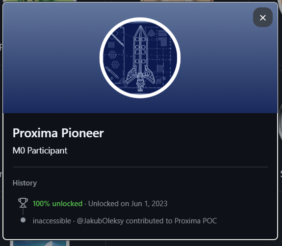

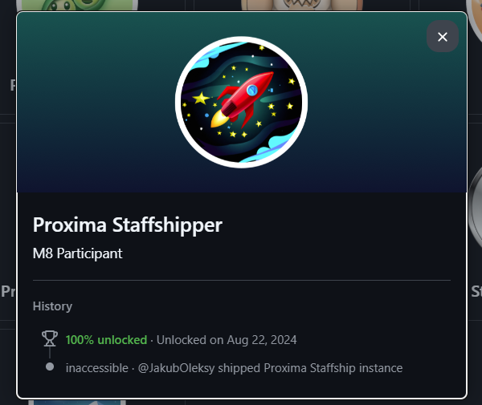

## 🔎 ଉତ୍ସ

ଅଧିକୃତ ଘୋଷଣା ସ୍ଥିତି ଓ କାର୍ଡ ଘଟଣା ନିଶ୍ଚିତ କରେ; ସମୁଦାୟ ସୀମା ନିରୀକ୍ଷଣ ଭାବେ ରହେ।

- **S01** — [Profile reference](https://docs.github.com/en/account-and-profile/reference/profile-reference) · ଅଧିକୃତ ଉତ୍ସ
- **S02** — [Open source goes to Mars (2021-04-19)](https://github.blog/news-insights/company-news/open-source-goes-to-mars/) · ଅଧିକୃତ ଉତ୍ସ
- **S03** — [Introducing Achievements (2022-06-09)](https://github.blog/news-insights/product-news/introducing-achievements-recognizing-the-many-stages-of-a-developers-coding-journey/) · ଅଧିକୃତ ଉତ୍ସ
- **S04** — [Arctic Code Vault snapshot (2020-02-02)](https://github.blog/open-source/maintainers/the-arctic-code-vault-starts-production-and-your-open-source-projects-are-being-archived/) · ଅଧିକୃତ ଉତ୍ସ
- **S05** — [GitHub Archive Program](https://archiveprogram.github.com/) · ଅଧିକୃତ ଉତ୍ସ
- **S06** — [Achievements disabled in GitHub Community (2024-02-06)](https://github.com/orgs/community/discussions/106536) · ଅଧିକୃତ ଉତ୍ସ
- **S07** — [Experimental achievements enabled in error (2026-03-27)](https://github.com/orgs/community/discussions/190746) · ଅଧିକୃତ ଉତ୍ସ
- **S08** — [Profile rendering incident; staff update 2026-09-23](https://github.com/orgs/community/discussions/203416) · ଅଧିକୃତ ଉତ୍ସ
- **S09** — [Profiles now show the highest achievement tier (2026-09-11)](https://github.blog/changelog/2026-09-11-profiles-now-show-your-highest-achievement-badge-tier/) · ଅଧିକୃତ ଉତ୍ସ
- **S10** — [JakubOleksy — Proxima Pioneer](https://github.com/JakubOleksy?achievement=proxima-pioneer&tab=achievements) · ପ୍ରୋଫାଇଲ୍ କାର୍ଡ
- **S11** — [JakubOleksy — Proxima Staffshipper](https://github.com/JakubOleksy?achievement=proxima-staffshipper&tab=achievements) · ପ୍ରୋଫାଇଲ୍ କାର୍ଡ
- **S12** — [timrogers — Proxima Staffuser](https://github.com/timrogers?achievement=proxima-staffuser&tab=achievements) · ପ୍ରୋଫାଇଲ୍ କାର୍ଡ
- **S13** — [GitHub Enterprise Cloud with data residency](https://github.blog/engineering/engineering-principles/github-enterprise-cloud-with-data-residency/) · ଅଧିକୃତ ଉତ୍ସ
- **S14** — [Discussion answered highlight replaced; support reported by a user](https://github.com/orgs/community/discussions/31629) · ସମୁଦାୟ ରିପୋର୍ଟ
- **S15** — [Schweinepriester — catalogue, experiments and historical artwork](https://github.com/Schweinepriester/github-profile-achievements) · ସମୁଦାୟ ରିପୋର୍ଟ
- **S16** — [GitHub Stars](https://stars.github.com/) · ଅଧିକୃତ ଉତ୍ସ
- **S17** — [Manage achievement visibility](https://docs.github.com/en/account-and-profile/how-tos/contribution-settings/manage-visibility-settings-for-private-contributions-and-achievements) · ଅଧିକୃତ ଉତ୍ସ
- **S18** — [Create a commit with multiple authors](https://docs.github.com/en/pull-requests/committing-changes-to-your-project/creating-and-editing-commits/creating-a-commit-with-multiple-authors) · ଅଧିକୃତ ଉତ୍ସ
- **S19** — [GitHub Sponsors](https://github.com/sponsors) · ଅଧିକୃତ ଉତ୍ସ
- **S20** — [GitHub Bug Bounty](https://bounty.github.com/) · ଅଧିକୃତ ଉତ୍ସ
- **S21** — [torvalds — Starstruck awarded card](https://github.com/torvalds?achievement=starstruck&tab=achievements) · ପ୍ରୋଫାଇଲ୍ କାର୍ଡ
- **S22** — [ljharb — Pull Shark awarded card](https://github.com/ljharb?achievement=pull-shark&tab=achievements) · ପ୍ରୋଫାଇଲ୍ କାର୍ଡ
- **S23** — [Rongronggg9 — Pair Extraordinaire awarded card](https://github.com/Rongronggg9?achievement=pair-extraordinaire&tab=achievements) · ପ୍ରୋଫାଇଲ୍ କାର୍ଡ
- **S24** — [ljharb — Galaxy Brain awarded card](https://github.com/ljharb?achievement=galaxy-brain&tab=achievements) · ପ୍ରୋଫାଇଲ୍ କାର୍ଡ
- **S25** — [Schweinepriester — Quickdraw awarded card](https://github.com/Schweinepriester?achievement=quickdraw&tab=achievements) · ପ୍ରୋଫାଇଲ୍ କାର୍ଡ
- **S26** — [Schweinepriester — YOLO awarded card](https://github.com/Schweinepriester?achievement=yolo&tab=achievements) · ପ୍ରୋଫାଇଲ୍ କାର୍ଡ
- **S27** — [ljharb — Public Sponsor awarded card](https://github.com/ljharb?achievement=public-sponsor&tab=achievements) · ପ୍ରୋଫାଇଲ୍ କାର୍ଡ

[ମୁଖ୍ୟ ପୃଷ୍ଠା](../README.md) · [ଯୋଗଦାନ କରନ୍ତୁ](../CONTRIBUTING.md)
